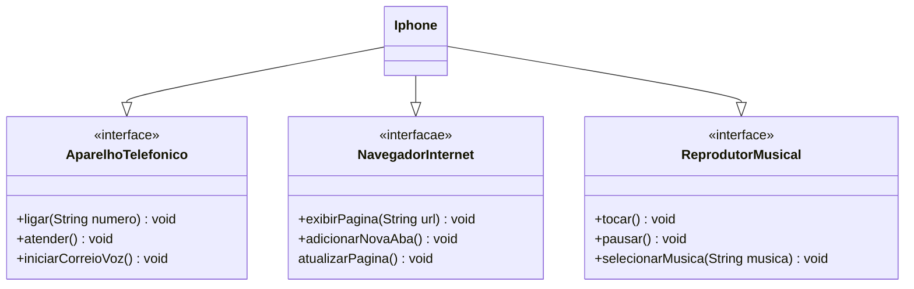

## Desafio POO 

Modelagem e código que representa as funções do Iphone para o desafio de POO de Java da [DIO](https://www.dio.me)

### Diagrama de Classes [Mermaid]

```mermaid
  classDiagram
direction TB
    class Iphone {
    }

    class AparelhoTelefonico {
	    +ligar(String numero) void
	    +atender() void
	    +iniciarCorreioVoz() void
    }

    class NavegadorInternet {
	    +exibirPagina(String url) void
	    +adicionarNovaAba() void
	    atualizarPagina() void
    }

    class ReprodutorMusical {
	    +tocar() void
	    +pausar() void
	    +selecionarMusica(String musica) void
    }

	<<interface>> AparelhoTelefonico
	<<interfacae>> NavegadorInternet
	<<interface>> ReprodutorMusical

    Iphone --|> AparelhoTelefonico
    Iphone --|> NavegadorInternet
    Iphone --|> ReprodutorMusical


```  
  
